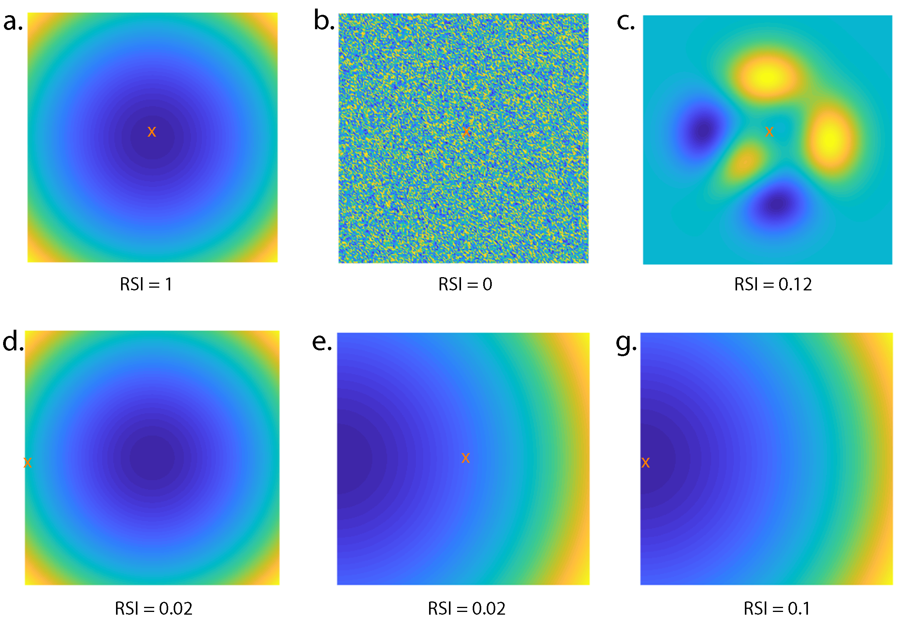

# RSI
Matlab codes for computing Radial symmetry Index (RSI).

Introduction: 
The Radial Symmetry Index quantifies the rotatial symmetry in images by assigning a value between 0 and 1, with 0 indicating no symmetry and 1 indicating perfect symmetry. Physically, RSI computes the variance in the magnitude of the data at every radial location and maps this variance between 0 and 1 using a sigmoid function. 

Test Cases: 

2D Fourier transforms are useful for visualizing spatial periodicity in images. Using MATLAB, a 2D transform can be computed using [fft2](https://www.mathworks.com/help/matlab/ref/fft2.html) function.  Below is a 2D transform for a cartesian image. 

*to do* Have 2 images (org, FFT) in the cartesian space, then 2 images in the polar space. 
